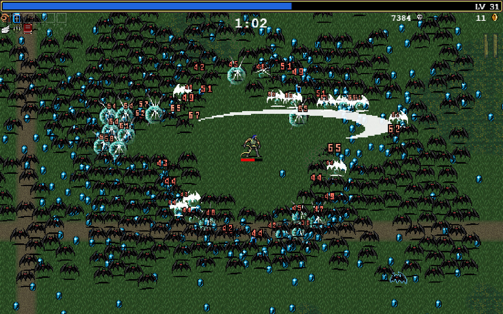
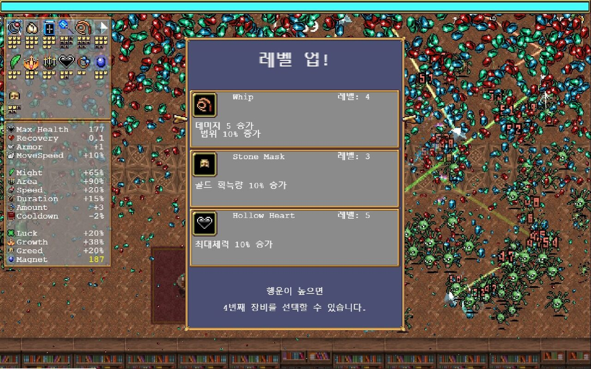
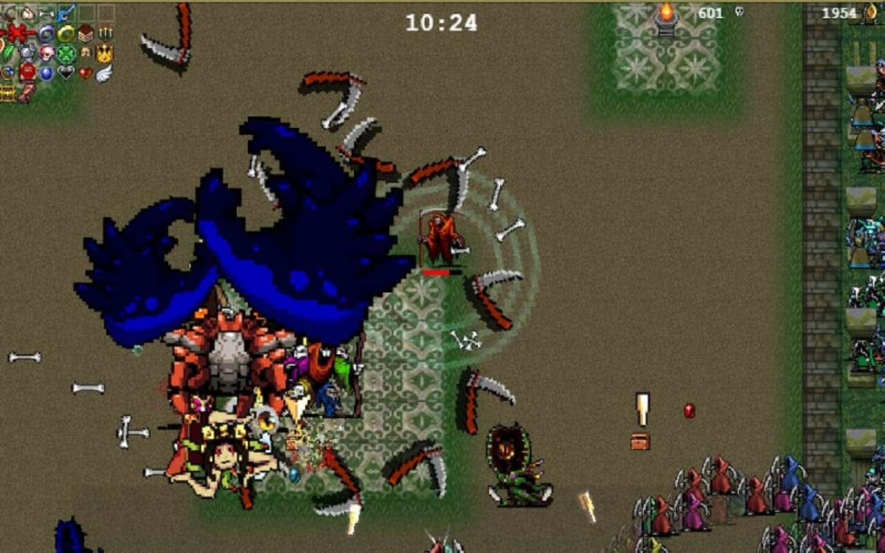
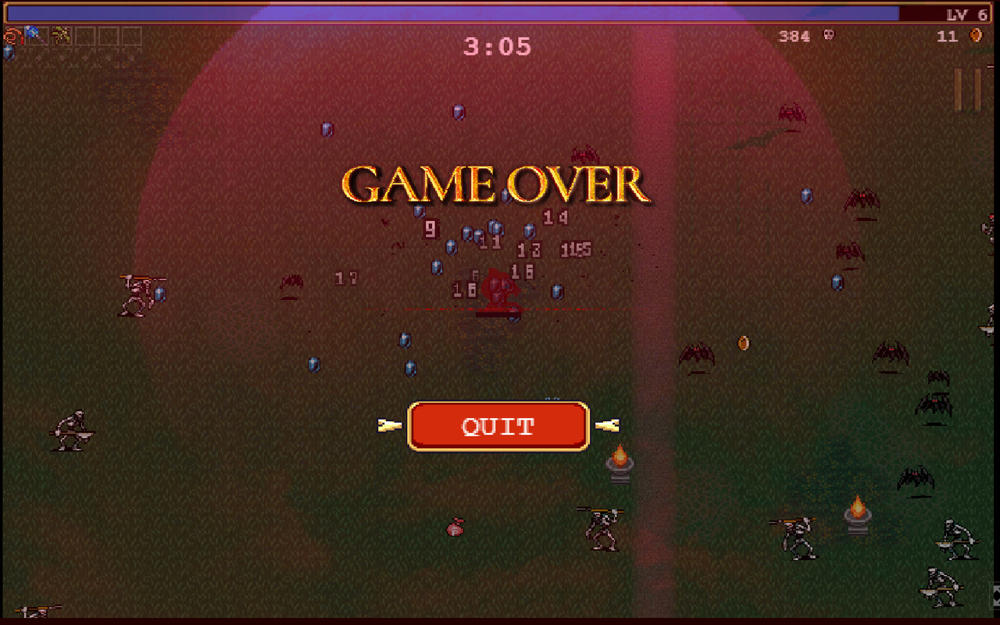

# Hero Survivor

### 2025-1 SPGP Term Project
Java 를 이용해 Android 환경에서 구동되는 Vampire Survivors 류의 게임 구현 목표

## 게임설명
사방에서 몰려오는 수많은 적을 쓰러뜨리며 살아남는 것이 주 목표인 게임입니다.

캐릭터를 조작하여 다가오는 몬스터를 피하거나 아이템을 이용하여 공격해 최대한 오래 생존해야 합니다.

몬스터와 충돌하면 캐릭터의 HP가 감소하며 HP가 0이 되면 게임오바됩니다.

몬스터를 처치하면 경험치가 드랍되고, 경험치를 획득해 아이템을 강화하거나, 새로운 아이템을 획득할 수 있습니다.

일정 시간이 되면 보스 몬스터가 등장하며, 보스를 처치하면 승리하게 됩니다.

### 게임화면

|  |  |
| :---: | :---: |
| 전투 | 레벨업 시 아이템 선택 |

|  |  |
| :---: | :---: |
| 보스몬스터 | 게임오바 |

### 개발 범위
- 캐릭터 조작
- 아이템
- 몬스터 이동 / 공격
- 애니메이션
- 경험치 구현
- 점수계산
- 게임오버
- 보스 몬스터
- 진행시간별 난이도 설정
- UI (경험치, HP바, 플레이 시간)

### 개발 일정
개발기간: 2025.04.07~2025.06.01 (8주)

| 주차 | 개발내용 |
| :---: | :---: |
| 1 | 리소스 수집 / 캐릭터 조작 |
| 2 | 캐릭터 조작 / 몬스터 이동 |
| 3 | 아이템 효과 구현 |
| 4 | 아이템 효과 구현 / 경험치 및 레벨업 구현 |
| 5 | 애니메이션 |
| 6 | 점수계산 / 일시정지 / UI |
| 7 | 보스몬스터 구현 |
| 8 | 최종 점검 |

