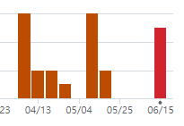
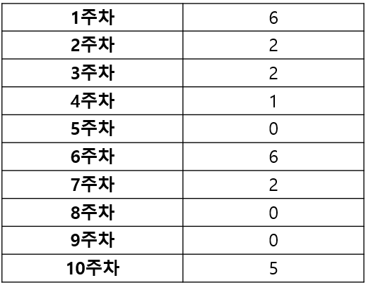

# Hero Survivor

### 2025-1 SPGP Term Project
Java 를 이용해 Android 환경에서 구동되는 Vampire Survivors 류의 게임 구현 목표

## 게임설명
사방에서 몰려오는 수많은 적을 쓰러뜨리며 살아남는 것이 주 목표인 게임입니다.

캐릭터를 조작하여 다가오는 몬스터를 피하거나 아이템을 이용하여 공격해 최대한 오래 생존해야 합니다.

### 게임화면

|  |  |
| :---: | :---: |
| 시작화면 | 인게임 |

### 개발 일정
개발기간: 2025.04.07~2025.06.01 (8주)

| 주차 | 개발내용 | 진행도
| :---: | :---: | :---: |
| 1 | 리소스 수집 | 100%
| 2 | 캐릭터 조작 | 100%
| 3 | 몬스터 이동 | 100%
| 4 | 아이템 효과 구현 / 경험치 및 레벨업 구현 | 0%
| 5 | 애니메이션 | 100%
| 6 | 점수계산 / 일시정지 / UI | 30%
| 7 | 보스몬스터 구현 | 0%
| 8 | 최종 점검 |

|  |  |
| :---: | :---: |
| Insights-commit | 주차별 커밋 통계 |

---
### 사용된 기술
Android Studio (Java),
  Object Recycle 및 Bitmap Polling 을 통한 최적화
  Collizion Detection
  Choreographer를 활용한 프레임 업데이트
  JoyStick 입력
  Canvas 기능을 활용한 맵 스크롤링

### 참고한 기술
 spgp2025 Git 수업자료 (DragonFlight, CookieRun, TuDefence),
  ChatGPT 를 활용한 리소스 제작 및 편집

### 수업내용에서 차용한 것
 EnemyGenerator,
  JoyStick,
  TuDefence 의 target 지정 발사

### 직접 개발한 것
 몬스터 이동,
  플레이어 조작,
  맵 스크롤링

### 하고 싶었지만 못 한 것들
캐릭터마다 다른 능력,
 경험치 및 레벨업,
 다양한 아이템의 조합,
 보스몬스터,

### 해결하지 못한 버그
플레이어와 몬스터의 충돌 시 HP 바가 줄어들지 않는 버그 발견,
 플레이어 및 몬스터 대각선 이동 시 정규화 또는 보정 필요

### 이번 수업에서 기대한 것, 얻은 것, 얻지 못한 것
Java 프로그래밍 능력을 키울 수 있었으며, 객체지향 및 객체간의 책임에 대해 더욱 깊이 이해할 수 있었다.
 텀 프로젝트를 계획대로 완수하지 못해 아쉽다.

### 더 좋은 수업이 되기 위해 변화할 점
수업 주차에 비해 많은 내용을 배우려다 보니 학기 초와 비교하여 수업 진도가 점차 빨라지게 되었다고 느꼈습니다. 학기 중, 후반부의 내용을 조금 앞당겨 전체적인 속도 조절이 필요하다고 생각합니다.